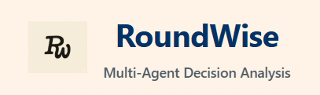
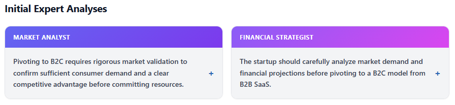
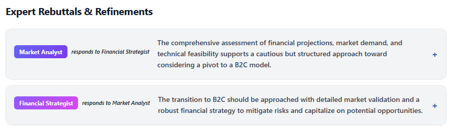
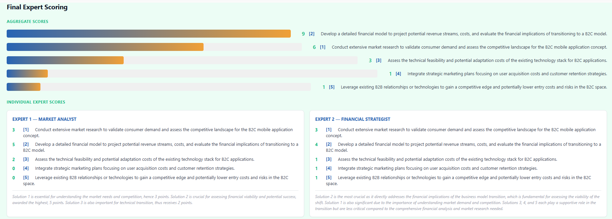

# RoundWise

<div align="center">
  
</div>

A structured, multi-agent decision support system that gives you 2 llm "experts" with configurable roles and missions; each provide their take on your problem, read the other llm's response, refine theirs, and vote on the best of all proposed solutions.

> IMPORTANT: This is a Proof of Concept that was built using a rapid prototyping methodology and supported heavily by AI. The goal is to validate the end-to-end orchestration flow of RoundWise to showcase the potential of multi-agent collaboration for decision analysis.


## Quick Start

### Backend Setup

```bash
cd backend
cp .env.example .env
# Edit .env and add your OPENROUTER_API_KEY
pip install -r requirements.txt
cd ..
python -m backend.main
```

Backend runs on `http://localhost:8000`

### Frontend Setup

```bash
cd frontend
cp .env.example .env
npm install
npm run dev
```

Frontend runs on `http://localhost:5173`

## Usage

### Example

**Problem:** "Should our startup pivot from B2B SaaS to B2C mobile app?"

1. **Stage 0 - Gatekeeper Output:**
   - Normalized Problem: "Should the startup pivot its business model from offering B2B SaaS products to providing B2C mobile applications?"
   - Key Dimensions: "Market Demand and Trends", "Financial Implications", "Technical Feasibility"
   - Proposed Experts:
     - **Market Analyst**: "Evaluate market viability and competitive positioning" -> (Gemini 2.5 Flash)
     - **Financial Strategist**: "Assess resource requirements and implementation feasibility" -> (GPT-4o Mini)

2. **Stage 1 - Initial Analyses (Parallel):**
   
   

3. **Stage 2 - Rebuttals:**
   
   

4. **Stage 3 - Notary Synthesis:**
   - "Both experts agree on the necessity of conducting thorough market research and detailed financial analysis before making a pivot. Each expert brings a unique perspective; the Market Analyst highlights the need for understanding consumer behavior and rapid iteration, while the Financial Strategist focuses on financial sustainability and leveraging existing B2B relationships. (...) They conclude that a strategic, well-informed approach is essential for transitioning to a B2C model, integrating both robust market validation and a comprehensive financial strategy."

5. **Stage 4 - Final Scoring:**
   
   

**Result:** Users see the complete deliberation process and aggregated scoring to make informed decisions.


## Pipeline Overview

1. **Stage 0 (Gatekeeper)**: Normalizes user problem and proposes 2 expert roles
2. **User Confirmation**: User can edit/approve the proposed expert roles
3. **Stage 1**: Experts provide initial independent analyses (parallel)
4. **Stage 2**: Experts read each other's analyses and provide rebuttals
5. **Stage 3**: Notary synthesizes discussion and extracts unique solutions
6. **Stage 4**: Each expert allocates 10 points across proposed solutions

## Key Features

- **Modular Architecture**: Each stage is isolated and can evolve independently
- **Graceful Degradation**: Continues even if individual LLM calls fail
- **Transparent Process**: All reasoning is displayed to users for validation
- **JSON Storage**: Simple file-based conversation persistence
- **Async Processing**: Parallel expert queries for improved performance

## Technology Stack

- **Backend**: Python, FastAPI, OpenRouter API
- **Frontend**: React, Vite, ReactMarkdown
- **Storage**: JSON files

## Configuration

See `.env.example` files in both `backend/` and `frontend/` directories for configuration options.
